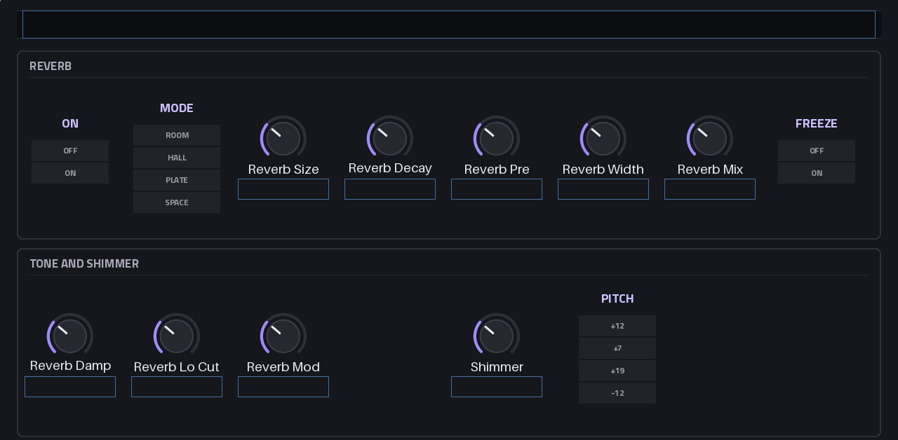

# EffectForce

**An effect rack that runs natively inside MPC on the Akai Force.**

EffectForce is a VST2 insert effect for MPC OS's built-in plugin host, with its own touchscreen pages
and Q-Link sets: ten modules in one insert slot, in any order, with macros, LFOs and a modulation
matrix across all of them. It is built on the same groundwork as its siblings
[PolyForce](https://github.com/Devko/PolyForce) and [SubForce](https://github.com/Devko/SubForce).

> [!NOTE]
> **Preview (0.0.x).** The rack, the performance mixer, the pages and the factory presets are
> complete and pass the full test suite on x86, under ARM emulation and on the Force's own CPU. On a
> Force (MPC OS 3.9) it installs and plays, at 6-8% of a block for a Perform preset. The parameter
> list may still change before v0.1: sounds and scenes are saved by name and survive that, but
> recorded automation (stored by parameter index) could then move a different control.



*The REVERB page, rendered offline from the skin (on the device MPC fills in the values).*

## Highlights

- **Ten modules, any order:** Drive (2x oversampled: soft, tube, hard, fold, sine, crush), Filter
  (12/24 dB state-variable: low, high, band, notch; stereo spread), EQ (low and high cut, two shelves,
  a bell), Comp (a compressor with sidechain low cut, or OTT-style 3-band upward and downward
  compression), Chorus (chorus, ensemble, Juno-style dimension), Phaser (4, 8 or 12 stages, or a
  flanger; synced to the beat), Pulse (tremolo, auto-pan, a 16-step rhythmic gate), Grain (granular
  textures on the beat: cloud, stretch, mosaic, stutter, arp; hold and feedback), Delay (stereo,
  ping-pong or mono; tape wow, feedback filters and drive, ducking; tape glide or crossfade) and
  Reverb (room, hall, plate, space; an 8-line feedback delay network with modulation, freeze and
  shimmer)
- **The CHAIN page:** the order as tiles; move a module left or right, switch it on or off. Switching
  fades, reordering never clicks, and a module that is off costs no CPU
- **Modulation:** 4 macros, 2 LFOs (free or locked to MPC's beat), an envelope follower, and an
  8-slot matrix reaching 54 parameters across the chain
- **A performance mixer, the Octatrack way:** the Force's crossfader between a clean scene and one
  of 64 named effects (filter sweeps, echo throws, washes, rolls, tape stops, gates, crush), picked from
  tiles; effects fade in with the fader and their tails ring out when it comes back, and the sweeps
  and risers move by themselves from the next bar line (an 8-bar filter sweep, a build roll). A looper that
  records the next 4 or 8 bars on the grid (or keeps the bar just played), and plays, layers, rolls
  (1/2 to 1/32), slows, stops or reverses it. On the master it turns the whole mix into a performance
  ([how](docs/USER_GUIDE.md#performance-scenes-and-the-looper))
- **Light on the CPU:** all ten modules on at their heaviest, p99 14.9% of a block on the Force (the
  budget is 15%); a Perform preset 6-8% ([Performance](docs/PERFORMANCE.md))
- **Built for MPC:** zero latency, tails that ring on through Stop, every getter cheap (MPC polls them
  hundreds of times a second), all measured on the device first ([the probe](docs/PROBE.md))
- **62 factory presets** in 11 categories (Perform: ten ready-made performance mixers),
  level-matched on reference material so a preset changes the sound more than the level; user presets,
  favorites, a browser

## Documentation

| Document | What's in it |
|---|---|
| [User guide](docs/USER_GUIDE.md) | The pages, the chain, every module, modulation, the scenes and the looper, presets |
| [Design](docs/DESIGN.md) | The rack, the modules, modulation, pages, budget: what v0.1 is and why |
| [Architecture](docs/ARCHITECTURE.md) | Source layout, the signal path, threads and real-time rules, saved state |
| [Performance](docs/PERFORMANCE.md) | The CPU budget and what each module costs on the Force |
| [Probe](docs/PROBE.md) | What MPC does with an insert effect, measured on the Force before the design |
| [Roadmap](docs/ROADMAP.md) | What's done, what's next, decisions |
| [Changelog](CHANGELOG.md) | What changed in each release |

## Requirements

- An **Akai Force**. Other first-generation (32-bit ARM) MPC OS devices may work but are untested.
- **Root SSH access** to the device (for example through MockbaMod). Stock MPC OS has no way to
  install third-party plugins.
- **MPC OS 3.x** (tested on 3.9). Release builds are made against glibc 2.31 but need GCC 11's
  libstdc++, and MPC OS 2.x doesn't draw a plugin's pages: 2.x is untested. A local build with a newer
  cross toolchain needs glibc 2.38 (3.x only; see [Releases](#releases)).

## Installation

Download a release package (`EffectForce-<version>-mpc-armv7.zip`) from
[Releases](https://github.com/Devko/EffectForce/releases) (or from the
[plugin catalog](https://sd88me.github.io/mpc-vst-plugins/)), or build one with `make plugin-package`.
Unzip it and follow the `INSTALL.md` inside. In short:

```sh
scp -r EffectForce-<version> root@<device-ip>:/tmp/
ssh -t root@<device-ip> sh /tmp/EffectForce-<version>/install.sh
```

The installer asks for confirmation (`-y` skips it), **stops MPC** (save your project first), copies
the plugin to `/sdcard/Synths/Devko - VST - EffectForce/`, backs up and edits `MPC.settings`, and
starts MPC again. Running it again upgrades in place and keeps your own presets (`Presets/` in that
folder) and favorites. Then add **EffectForce** to a track's insert (or a return, a submix, the
master) from MPC's effect plugins. To play the performance mixer with the Force's crossfader, learn
it to EffectForce's Crossfader ([how](docs/USER_GUIDE.md#the-crossfader)).

To uninstall, run the package's `uninstall.sh` the same way: it stops MPC, removes the plugin and its
`MPC.settings` entry (after a backup) and starts MPC again; your own presets and favorites stay in the
plugin folder (delete it to remove them too).

## Building

Linux or WSL, as for PolyForce ([its build docs](https://github.com/Devko/PolyForce/blob/main/docs/BUILDING.md)
list the packages):

```sh
make test                  # every module and the plugin under ASan/UBSan
make test-arm              # the same suite built for the Force, under qemu-arm
make test-module M=reverb  # one module's tests on their own
make arm-plugin            # build/arm/effectforce.so
make skin preview          # the skin, and every page as surface/build/page_*.png
make plugin-package        # dist/EffectForce-<version>-mpc-armv7.zip
make plugin-install        # onto the Force (FORCE=root@<ip> in local.mk); restarts MPC
make bench-device          # CPU per module and all at once, on the Force
make levels                # the factory presets' levels (make preset-levels sets them)
```

`surface/surface.py` is the single source of the parameter list, the pages and the factory presets'
checks; it writes `params.json`, `layout.conf`, `vst.json` and the C++ headers.

## Releases

Release packages come from CI ([`.github/workflows/build.yml`](.github/workflows/build.yml)), never from
a local build: the device build runs in `arm32v7/gcc:11-bullseye` (GCC 11, glibc 2.31) under QEMU,
profile-guided, the suite runs against the objects the `.so` is linked from, and the zip must pass the
[plugin catalog](https://github.com/sd88me/mpc-vst-plugins)'s `catalog_check.py`. Every run keeps the
zip as an artifact. To release:

1. Add a `## X.Y.Z` section to [CHANGELOG.md](CHANGELOG.md): it becomes the release's notes, which the
   catalog shows (a tag without one fails before anything is published).
2. Tag and push: `git tag vX.Y.Z && git push origin vX.Y.Z`. A plain tag publishes a regular release,
   which the catalog lists with a download; `vX.Y.Z-beta` publishes a prerelease, the catalog's beta
   channel (hidden unless a visitor asks for betas). The plugin's version is the tag without its suffix.
3. The catalog picks the release up by itself (nightly). Once the release zip has been installed and
   played on a Force, add it to `tested.json` (the repo's root; SubForce's has the form): the catalog
   shows it as "Tested on".

The version's first number is the catalog's `param_compat`: while it is 0 the parameter list may change;
from v0.1 it is append-only.

## Status

| Stage | |
|---|---|
| The rack: ten modules, the chain, modulation, 14 pages, 62 presets, tests, package | ✅ |
| The performance mixer: scenes, the FX library, scene moves, the looper | ✅ |
| Release build in CI (glibc 2.31, profile-guided, catalog-checked) | ✅ |
| On the device: installs, plays, benches (`make bench-device`), the suite on its CPU | ✅ |
| [0.0.1](https://github.com/Devko/EffectForce/releases/tag/v0.0.1) — the first release (regular, catalog-checked) | ✅ |
| In the plugin catalog (the registry entry's PR) | 🔜 |
| v0.1 — parameter list frozen (append-only from then on) | ⬜ |

Details in the [roadmap](docs/ROADMAP.md).

## License

EffectForce is released under the [MIT License](LICENSE). Third-party components keep their own
licenses (below).

## Credits

- Plugin groundwork (VST2 glue, touchscreen logic, preset library, build and bench tooling):
  [PolyForce](https://github.com/Devko/PolyForce) and [SubForce](https://github.com/Devko/SubForce), MIT.
- DSP from the literature: Andrew Simper's linear trapezoidal state-variable filter (Cytomic) and
  Vadim Zavalishin's topology-preserving transform; Laurent de Soras's HIIR halfband structure;
  Jean-Marc Jot's decay gains for the reverb's feedback delay network.
- Skin generator, previews, installer and the catalog checker:
  [sd88me/mpc-vst-plugins](https://github.com/sd88me/mpc-vst-plugins) (MIT, Copyright (c) 2026 sd88me),
  vendored in `third_party/mpc-vst-plugins` with a few small, marked patches.
- Interface font: [Titillium Web](https://fonts.google.com/specimen/Titillium+Web), SIL Open Font
  License 1.1 (`surface/fonts/OFL.txt`).
