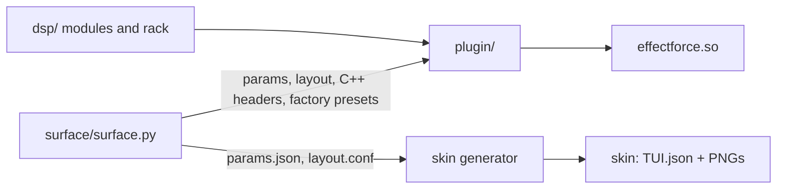
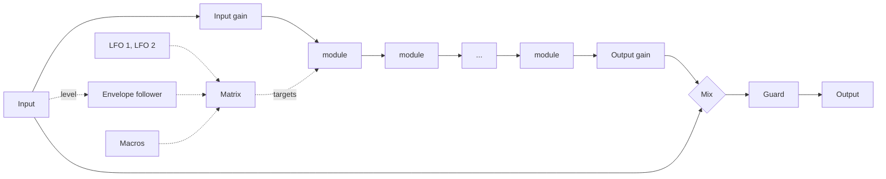

# Architecture

- [Overview](#overview)
- [Source layout](#source-layout)
- [Signal flow](#signal-flow)
- [Threads and real-time rules](#threads-and-real-time-rules)
- [Talking to MPC](#talking-to-mpc)
- [Parameters and saved state](#parameters-and-saved-state)

---

## Overview

EffectForce is a single shared object, `effectforce.so`, that MPC loads through its VST2 host as an
insert effect (2 inputs, 2 outputs), plus a touchscreen skin generated at build time.

- **`surface/surface.py`** is the single source of the parameter list, the pages and the factory
  presets' checks. It writes `params.json`, `layout.conf`, `vst.json`, `build/param_ids.h` and
  `build/factory_presets.h`, after checking the layout (PolyForce's checker) and every preset.
- **`dsp/`** is the sound: ten modules with one contract (docs/DESIGN.md "Modules"), the rack that
  chains them, the LFOs and the envelope follower. No VST, no files, no threads.
- **`plugin/`** is everything between the sound and MPC: VST2 entry points, parameters, the
  modulation matrix, the touchscreen logic, presets and saved state.

## Source layout

| Path | Contents |
|---|---|
| `surface/surface.py` | Parameters, pages, factory preset checks; generates everything the skin and the C++ side need |
| `surface/skin_polish.py` | PolyForce's: redraws knob strips, buttons and stepper arrows; makes each group's pages sub-pages of one tab |
| `dsp/common.h` | The module contract, rate and chunk, `Transport`, sync divisions, `Ramp`, `DelayLine`, Hermite interpolation |
| `dsp/fastmath.h`, `simd.h`, `halfband.h` | SubForce's fast math and four-float vectors; the 2x halfband interpolator and decimator |
| `dsp/drive.*` | 2x oversampled shapers, compensation table, tilt, Crush |
| `dsp/svf.h`, `filter.*`, `eq.*` | Simper's state-variable filter, the Filter and the EQ |
| `dsp/comp.*` | The compressor and the 3-band OTT |
| `dsp/chorus.*`, `phaser.*` | Modulated delays (chorus, ensemble, dimension, flanger) and allpass cascades |
| `dsp/pulse.*` | Tremolo, auto-pan and the 16-step gate on a beat-locked phase |
| `dsp/grain.*` | An 8 s recording (three rates, for pitched grains without aliasing) replayed as grains, slices and notes on MPC's grid |
| `dsp/delay.*` | Double-precision delay time, feedback filters, drive and limiter, wow, ducking |
| `dsp/reverb.*`, `pitch.h` | Predelay, diffusion, an 8-line feedback delay network, modulation, freeze; the shimmer's pitch shifter |
| `dsp/mod.h` | LFOs (free or beat-locked), the envelope follower |
| `dsp/rack.*` | The order, on / off fades, the reorder dip, levels, the global mix |
| `plugin/plugin.cpp` | VST2 glue for an insert effect, the suspend rule, the output guard, the CPU meter |
| `plugin/engine.*` | The chunk loop: modulation sources, the matrix, the rack |
| `plugin/rack_map.*` | 0..1 <-> real values, value text, parameters -> the rack's patch |
| `plugin/surface.*` | SubForce's (PolyForce's, RackForce's): stepping, buttons, tiles, the browser, pushes to MPC; plus the CHAIN page |
| `plugin/state.*`, `presets.*`, `library.*`, `paths.*` | Saved state, preset files and the factory set, file libraries, folders |
| `plugin/trace.*` | Device diagnostics while `/tmp/effectforce.trace` exists |
| `presets/Factory/` | Factory presets: `NN_Category/NN_Name.efp` |
| `test/` | Every module's suite, the rack, modulation, the plugin through a fake MPC (`host.h`) |
| `tools/bench.cpp` | `efbench`: CPU per module and all at once, through the built `.so` |
| `tools/pgo_train.cpp` | The profile-guided build's trainer: every module's options, everything at once, every preset |
| `tools/make_presets.py` | Writes the factory presets (then `make preset-levels` sets their Output) |
| `tools/levels.cpp`, `loudness.h` | Level-matching the factory presets on a reference mix |
| `probe/` | The probe that measured MPC first (docs/PROBE.md); builds on its own |
| `third_party/mpc-vst-plugins/` | Vendored skin generator and installer (MIT), with PolyForce's marked local patches |

## Signal flow

Everything runs in **32-sample chunks** (four per MPC block). Per chunk:

1. **Modulation** (`plugin/engine.cpp`): every matrix slot adds amount × source to its target's 0..1
   value, clamped, through the knob's own curve, into a copy of the patch. Sources are the ones of
   the chunk before (0.7 ms: inaudible).
2. **Sources** for the next chunk: the envelope follower on this chunk's input, both LFOs.
3. **The rack** (`dsp/rack.cpp`): input gain; each module in order gets `set()` with its real
   parameters, then `process()` in place; modules fading in or out are blended with their input;
   output gain; the global mix with the dry input.

The **output guard** (`plugin/plugin.cpp`) keeps every sample finite and within ±8 (+18 dBFS).

## Threads and real-time rules

| Thread | Runs |
|---|---|
| **Audio** (one of MPC's audio workers; which one changes between calls, instances run concurrently) | `processReplacing`: the engine, the CPU meter, every call back into MPC |
| **UI** (MPC's UI side) | Parameters, display text, saved state (chunks), the browser, preset loads, suspend / resume |

- Nothing on the audio thread allocates, locks or throws. Modules allocate in their constructors.
- Host callbacks happen only from `processReplacing`; never from `setParameter` or the dispatcher.
- A `try`/`catch` stands between every entry point and MPC: an exception never reaches the host.
- Denormals are flushed to zero while a block renders.
- The surface hands the audio thread a snapshot of every sound parameter; preset loads and chain
  moves are written as one batch (a seqlock), so the audio thread never plays half of one.

## Talking to MPC

What MPC does with an insert effect was measured on the device first ([the probe](PROBE.md)):

- It calls `processReplacing` nonstop, in place, 128 frames at a time, playing or not.
- Transport **Stop** suspends and resumes the plugin within ~100 ms; the slot's **ON button**
  suspends it for as long as it is off. EffectForce keeps every buffer through a suspend under
  250 ms (tails ring on through Stop) and clears them after a longer one (`plugin/plugin.cpp`).
- It never calls `effSetBypass`, and can't take a latency change at runtime: every module is
  zero-latency.
- It polls names, categories and parameter texts hundreds of times a second while the screen is
  open: every getter reads caches.
- The Force's input rules (a tap is a lone 1, a Q-Link detent is the read-back plus 1/128, a tile's
  release echo ~0.7 s later) are SubForce's surface, unchanged; see PolyForce's
  [Milestone 1 design](https://github.com/Devko/PolyForce/blob/main/docs/M1_DESIGN.md), §6.

## Parameters and saved state

- **Parameters** are free to change until v0.1, then **append-only**: MPC projects store values by
  index. Append-only covers option lists too: MPC stores an option as its 0..1 value, which moves
  for every option when one is added (`order_*` grew from 8 to 10 options, `m*_dst` from 49 to 55
  before v0.1), so a list that may grow gets a new parameter, or a fixed number of options from
  v0.1 on.
- **Kinds** (`surface.py`): sound parameters (saved, automatable), the chain's order (saved, moved
  only by MOVE, not automatable), the surface's own values (the selected slot, the browser), readouts,
  buttons, tiles, toggles, popup flags.
- **Saved state** (projects and `.efp` preset files) is the text format `effectforce 1`: `key=value`
  lines of real values (Hz, seconds, dB), options by name (`dly_mode=Ping-Pong`, `order_3=Comp`), and
  in a project the preset it came from. Ranges and option lists can change without breaking saved
  sounds; an order that names only some slots (0.0.1 saved eight) keeps them and fills the rest in
  the default order, one that isn't a permutation of the modules falls back to the default.
- **Limits:** `surface.py`'s module, source, wave and division lists, the pulse's modes and
  patterns, the grain's modes and the shimmer's intervals must match the C++ enums;
  `plugin/rack_map.cpp` `static_assert`s it.
