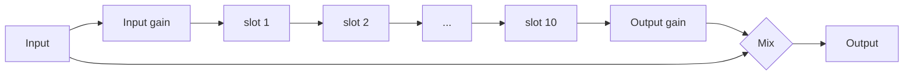

# EffectForce v0.1 design

The record of what v0.1 is and why, after the [probe](PROBE.md). Code follows it; where they
disagree, fix one of them.

- [What the probe decided](#what-the-probe-decided)
- [The rack](#the-rack)
- [Modules](#modules)
- [Modulation](#modulation)
- [Performance: scenes and the looper](#performance-scenes-and-the-looper)
- [Pages](#pages)
- [Presets](#presets)
- [Budget](#budget)
- [Code layout](#code-layout)
- [Tests](#tests)

---

## What the probe decided

| Probe finding | Design consequence |
|---|---|
| Insert effect works; tempo, beat position and play/stop arrive | Synced delay and LFOs lock to MPC's beat |
| `process` runs nonstop in real time, 128 frames, **in place** | Modules process in place; a module that needs its input after writing output keeps its own copy |
| Transport Stop: suspend + resume within ~100 ms; the slot's ON button: suspend, later resume, no `effSetBypass` | **Suspended for under 250 ms: keep every buffer** (tails survive Stop). **Longer: clear** (no stale echoes when a slot is switched back on) |
| `acceptIOChanges` no; latency only at creation | Every module zero-latency (no lookahead, no linear phase) |
| MPC polls names, categories and parameter texts hundreds of times a second | Getters read caches only; nothing in them allocates more than a short string |
| CPU of the probe 0.5% | The budget below is for the modules themselves |

## The rack



- **Ten modules, each exactly once:** Drive, Filter, EQ, Comp, Chorus, Phaser, Pulse, Grain, Delay,
  Reverb (Pulse, Grain and the Reverb's shimmer came after the first device run).
  Each has its own parameters and page, so MPC's automation, Q-Links and saved projects always
  mean the same thing (generic slots would not). The default order is the one above.
- **Order:** ten hidden parameters `order_1..10` hold a permutation of the modules. The CHAIN
  page moves the selected module left or right (a swap). Saved by name (`order_3=Comp`). A state
  that names only some slots (0.0.1 saved eight) keeps them and gives the rest the modules it
  doesn't name, in the default order (they were off in it); one that isn't a permutation falls back
  to the default order.
- **On / off:** each module's own `*_on`. Switching fades over 10 ms; a module that is off is not
  processed at all (no CPU). A module switched on again starts from cleared state.
- **Reordering** dips the rack's output to silence over 3 ms, swaps, and fades back over 3 ms: no
  click, no doubled CPU.
- **Global:** Input and Output gain (-24..+24 dB), Mix (dry / wet of the whole chain; 100% for
  inserts, lower for parallel use).
- **Control rate:** 32-sample chunks. Per chunk: modulation, then each module's `set()` with its
  real parameter values, then `process()`. Modules smooth their own parameters across the chunk.

## Modules

Every module is a class in `dsp/` with the same shape:

```cpp
class Chorus {
public:
    struct Params { /* real values: Hz, seconds, dB, 0..1, option indices */ };
    Chorus();                                         // allocates (UI thread)
    void reset();                                     // clears all state; the next set() jumps to its targets
    void set(const Params& p, const Transport& t);    // once per chunk, before process()
    void process(float* L, float* R, int n);          // in place, 1 <= n <= kChunk
    int  tailSamples() const;                         // how long it rings after the input stops (0: none)
};
```

No allocation, locks or exceptions in `set` / `process`; finite output for any finite input and
any parameter values, including the extremes and abrupt changes; a NaN or infinity in the input
never gets into a feedback path. Each module's own Mix is a dry / wet blend inside it.

| Module | Parameters (key: range, default) | DSP |
|---|---|---|
| **Drive** | `drv_type` Soft · Tube · Hard · Fold · Sine · Crush; `drv_amt` 0..36 dB (12); `drv_tone` -1..1 tilt (0); `drv_bias` 0..1 (0); `drv_out` -24..12 dB (0); `drv_mix` (100%) | 2× oversampled (polyphase IIR halfband up and down, SubForce's design) around the shaper; bias before, DC blocker after; tilt EQ after; gain compensation so Drive mostly adds character, not level. Crush: bit depth and sample-rate reduction, not oversampled |
| **Filter** | `flt_type` LP 12 · LP 24 · HP 12 · HP 24 · BP · Notch; `flt_cut` 20..20k Hz log (1k); `flt_res` 0..1 (0.2); `flt_drive` 0..1 (0); `flt_spread` -1..1 octave L/R (0); `flt_mix` (100%) | Simper state-variable filter (TPT), coefficients interpolated across the chunk, soft saturation before it |
| **EQ** | `eq_lc` 20..1000 Hz (20 = off); `eq_lf` 30..500 Hz (100), `eq_lg` ±18 dB; `eq_mf` 100..10k (1k), `eq_mg` ±18 dB, `eq_mq` 0.3..8 (1); `eq_hf` 1k..16k (6k), `eq_hg` ±18 dB; `eq_hc` 1k..20k (20k = off) | Simper SVF shelves, bell, 12 dB/oct cuts; modulation-safe |
| **Comp** | `cmp_mode` Comp · OTT; Comp: `cmp_thr` -60..0 dB (-18), `cmp_ratio` 1..20 (4), `cmp_att` 0.1..100 ms (10), `cmp_rel` 10..2000 ms (150), `cmp_knee` 0..24 dB (6), `cmp_sc` sidechain low cut 20..500 Hz (20 = off), `cmp_makeup` -12..24 dB (0, both modes), `cmp_mix` (100%); OTT: `ott_depth` (60%), `ott_time` 0.1..10× (1), `ott_up` (100%), `ott_down` (100%), `ott_low` / `ott_mid` / `ott_high` ±12 dB | Comp: feed-forward, stereo-linked, soft knee, log-domain gain computer. OTT: 3 bands (Linkwitz-Riley 4th order at 88 Hz and 2.5 kHz, summing flat), each with downward and upward compression |
| **Chorus** | `chr_mode` Chorus · Ensemble · Dimension; `chr_rate` 0.03..10 Hz (0.5); `chr_depth` (50%); `chr_delay` 1..40 ms (12); `chr_lc` wet low cut 20..1000 Hz (120); `chr_width` (100%); `chr_mix` (50%) | Modulated delay lines with cubic interpolation: 2 voices per side (Chorus), 3 with a slow and a fast LFO (Ensemble), Juno-style antiphase pair (Dimension) |
| **Phaser** | `phs_mode` Phaser 4 · Phaser 8 · Phaser 12 · Flanger; `phs_sync` Free · Sync; `phs_rate` 0.01..20 Hz (0.3); `phs_div` 1/16..16 bars (1 bar); `phs_depth` (70%); `phs_center` 0..1 (0.5; 50 Hz..8 kHz for a phaser, 0.2..10 ms for the flanger); `phs_fb` -0.95..0.95 (0.5); `phs_stereo` 0..180° (90); `phs_mix` (50%) | First-order allpass cascade with feedback; the flanger a cubic-interpolated short delay with feedback. Synced: the LFO's phase follows MPC's beat |
| **Delay** | `dly_mode` Stereo · Ping-Pong · Mono; `dly_sync` Free · Sync (Sync); `dly_time` 1..2000 ms (375); `dly_div` 1/64..1 bar (1/8.); `dly_fb` 0..100% (40); `dly_spread` -50..50% R time (0); `dly_lc` 20..2000 Hz (100); `dly_hc` 500..20k Hz (8k); `dly_wow` (0); `dly_drive` (0); `dly_duck` (0); `dly_mix` (30%); `dly_glide` Tape · Fade | The probe's delay grown up: double-precision delay time that glides (Tape) or crossfades (Fade) to a new time, filters and a soft clipper in the feedback (100% feedback holds, never runs away), wow (slow + fast modulation of the time), ducking by the input's envelope |
| **Pulse** | `pls_mode` Tremolo · Auto-Pan · Gate; `pls_sync` Free · Sync (Sync); `pls_rate` 0.1..20 Hz (4); `pls_div` (1/8); `pls_depth` (100%); `pls_shape` (0); `pls_stereo` 0..180° (0); `pls_pattern` 16 patterns; `pls_length` 5..100% (50); `pls_smooth` 0.5..50 ms (3); `pls_mix` (100%) | A beat-locked LFO (sine to square) on the level or the constant-power pan; the gate a 16-step mask with S-curve edges, step 0 on the downbeat; transport jumps crossfade |
| **Grain** | `grn_mode` Cloud · Stretch · Mosaic · Stutter · Arp; `grn_sync` (Sync); `grn_size` 10..1000 ms (120); `grn_div` (1/16); `grn_density` (50%); `grn_pitch` ±24 st (0); `grn_reverse` (0); `grn_spread` (50%); `grn_fb` 0..95% (0); `grn_hold` Off · On; `grn_mix` (50%) | An 8 s stereo recording of the input replayed as windowed grains or beat-grid slices, pitched, reversed, reshuffled; feedback writes the output back; hold stops recording |
| **Reverb** | `rev_mode` Room · Hall · Plate · Space; `rev_size` (50%); `rev_decay` 0.1..30 s (2.5); `rev_pre` 0..250 ms (20); `rev_damp` 1k..20k Hz (6k); `rev_lc` 20..1000 Hz (150); `rev_mod` (30%); `rev_width` (100%); `rev_freeze` Off · On; `rev_mix` (30%); `rev_shim` (0), `rev_shim_int` +12 · +7 · +19 · -12 | Predelay, input diffusion (allpasses), an 8-line feedback delay network (Hadamard mixing, per-line damping set from Decay and Damp, modulated lines), stereo taps. Freeze: lossless loop, input muted. Shimmer: a splice-searching pitch shifter on one of the network's eight directions, energy-preserving (bounded, frozen too; frozen with shimmer the tail drains as it climbs out of the band) |

Every module also has `*_on` (Off / On). Sync divisions: delays `1/64 … 1 bar` (16 values),
LFOs `1/16 … 16 bars` (14 values), each with triplets and dotted values where they make sense.

## Modulation

- **Sources:** Macro 1-4 (knobs, 0..1), LFO 1 and 2 (-1..1), Envelope follower (0..1 from the
  input level).
- **LFO:** wave Sine · Triangle · Saw Up · Saw Down · Square · S&H · Smooth; Free (0.01..20 Hz)
  or Sync (1/16 … 16 bars, phase locked to MPC's beat while it plays); phase 0..360°.
- **Envelope follower:** attack 1..500 ms, release 10..3000 ms, gain 0..36 dB (sensitivity).
- **Matrix:** 8 slots of source, target, amount (-100..100%). A target is any of 54 continuous
  parameters (the levels, every module's main knobs, the LFO rates; a rate only while its LFO,
  phaser or pulse runs free). Modulation adds
  `amount × source` to the target's 0..1 value, clamped, so it follows the knob's own curve
  (log for frequencies, and so on). Computed per 32-sample chunk; modules smooth from there.

## Performance: scenes and the looper

The Octatrack's performance-mixer setup, in one insert (on the master, or any track): the rack's
modules as the effects, two **scenes** at the ends of a **crossfader**, and a **looper** that grabs
what just played and plays it on the beat. The Force's own crossfader drives it: MPC can learn any
automatable parameter to it (hold ASSIGN A or B and move the parameter), so `xfade` is an ordinary
parameter, also on a Q-Link and on the PERFORM page.

### Scenes

- **Eight scenes**, each a set of **locks**: a parameter and the value it takes in that scene.
  `scene_a` and `scene_b` pick the scene at each end of the fader; `xfade` 0 is A, 1 is B. Changing
  the scene at the end the fader is away from is silent (the DJ's way to line up the next move).
- **What a parameter plays** at fader position x: `a` = its lock in scene A, or the knob if A
  doesn't lock it; `b` the same for B; then by kind:

  | Kind | Morph |
  |---|---|
  | Continuous (lin, log, pow, int) | `a + (b - a) x` in the knob's 0..1 space, so it follows the knob's curve |
  | Ordered steps (sync divisions, loop length, repeat) | the index walks from a to b step by step (a roll speeds up as the fader moves) |
  | Other options and switches (types, modes, sync, freeze, hold, matrix routing) | `a` below the middle, `b` from it |
  | A module's On | a **send**, below |

- **A module switched by the fader** (On in one scene, Off in the other, or locked On against a
  knob that is Off) runs while either end has it on, and the fader moves its input level s from
  0 (the Off end) to 1 (the On end): out = in (1 - s) + module(in s). At the On end that is exactly
  the module; at the Off end the input passes and the module's **tail rings out** (a delay throw,
  a reverb wash). Once s has been 0 for the module's tail time it stops (no CPU) until s rises,
  and then starts from cleared state, as a module switched on by its knob (a compressor without
  the gain reduction it stopped with, a synced phaser on the song's phase).
  A module that no scene switches keeps send 1: today's rack, bit for bit.
- **Not lockable:** the fader and the scene picks, the edit switches, Looper On (it arms the
  recorder, which must run before a loop can be grabbed), the chain's order, and everything the
  surface keeps for itself. Everything else is: levels, macros (a macro moved by the fader drives
  its matrix targets), every module's parameters, the LFOs, the matrix, the looper's controls.
- **Modulation** adds to the morphed value, as it adds to the knob's.
- **The fader is smoothed**: the engine follows `xfade` with a 15 ms one-pole per chunk, so a
  Q-Link's 1/128 detents and MPC's 1/1000 steps sweep instead of stepping; the morph is worked out
  per chunk for the locked parameters only.
- **Edit:** EDIT A (or B) shows the scene picked at that end on every page: each knob reads its
  lock, or the knob's own value where the scene has none, and **you hear the scene in full** (as
  if the fader were at that end). Every parameter you move while editing is **locked** in it.
  Tapping another scene tile at the edited end switches the edit to that scene. CLEAR removes the
  edited scene's locks. Tapping the lit EDIT again, loading a preset or Init ends the edit: the knobs
  come back as they were. While editing, the plugin's saved state keeps the knobs, not the scene.
- **Saved** with the project and in presets as lines `sceneN.key=value` (N 1..8), values like the
  other lines (real values, options by name), so they survive parameters being added. A preset
  without scene lines has none.
- **Lock store:** per scene a 0..1 value per parameter, -1 where nothing is locked, as atomics
  (the surface writes on MPC's UI thread, the engine reads on the audio thread). A generation
  counter tells the engine to rebuild its list of locked parameters (the union of A's and B's).

### Scene moves

A scene can move by itself (2026-10-06; the decisions in
[plans/2026-10-06-scene-moves-design.md](plans/2026-10-06-scene-moves-design.md)): LP Sweep closes
from 18 kHz to 150 Hz over 8 bars once the fader brings it in. The fader stays the A/B mixer; the
motion is the scene's.

- **A move:** some of a scene's locks have a **start** besides the lock (its end), and the scene a
  **LENGTH** (Off · 1 beat · 2 beats · 1 bar · 2 · 4 · 8 · 16 bars) and a **PLAY** (Once holds the end,
  Loop starts again, Ping-pong goes back, LENGTH each way). What can move: the Line kinds, continuous
  on the knob's curve and ordered steps in order (Repeat 1/4 → 1/32 is a build). Switches and a
  module's On can't. LENGTH Off: the scene holds its locks, as before moves.
- **When:** a scene's move runs while the scene is heard and starts over once it is fully out. The
  fader leaving A (by more than half a Q-Link detent) arms B's; it starts on the grid's next line, a
  bar (a beat for a move under a bar), and until then B plays its starts. A push up to a 16th of the
  line late counts from that line. Back at A (the fader's target, and its glide, there) resets it.
  Scene A mirrors it, so at load with the fader at A, A's move starts on the first bar line. Another
  scene at an end, or a change to the scene's move (a start, its timing, an effect loaded), starts
  that end's over.
- **Time:** the grid is MPC's song position while it plays, and runs on at the tempo while it is
  stopped (the looper's rule). Once armed or running, a move counts beats played, chunk by chunk:
  a tempo change bends it, a locate or the sequence's loop point doesn't move it. Bars are 4 beats.
- **Values:** an end plays `start + (lock − start) · at` for each moving lock, `at` from its clock
  (0 armed, a line for Once and Loop, a triangle for Ping-pong, exactly the lock once a Once is done),
  and the fader blends the two ends as before; modulation adds on top. `rebuild()` keeps a lock whose
  ends agree only at the lock (B sweeping down to the knob's own value still moves).
- **Cost:** the morph runs per chunk while either clock is armed or running, as it does while the
  fader glides; a log-curve parameter then goes by the fast exp2 (`modulate()`'s), and exactly
  (`paramValue`) once nothing moves. Nothing moving: nothing to pay.
- **On the page:** PERFORM's LENGTH and PLAY show and set the move of the scene at B, or of the scene
  being edited (the FX tiles' rule); not knobs, not lockable, saved with the scene. A change marks an
  effect's name `*`. The scenes' line shows each end's move: `MOVES ON THE BAR`, `BAR 3 OF 8`,
  `HELD`. In EDIT the knobs show (and you hear) the locks; a moving lock turned there becomes a plain
  lock.
- **Saved** as `sceneN.move=8 bars` and `sceneN.play=Once` (only for a scene with a move) and a
  moving lock as `sceneN.flt_cut=18000>150`; in an effect file the same without `sceneN.`. Files
  without arrows load as before. `surface.py` checks them: an arrow only on a Line parameter, both
  values in range, an effect with arrows has `move=` and `play=` and the other way round.
- **Store:** a second table of starts per scene (atomics, -1: holds still), the timing per scene,
  and a per-scene move epoch that tells the engine to start that scene's move over.

### The FX library

64 effects in four banks of 16 (Filter, Space, Loop, Rhythm), `presets/FX/N_Bank/NN_Name.eff`,
written by `tools/make_fx.py`, checked by `surface.py` like the presets and embedded
(`build/fx_library.h`). An effect is a scene's text: `name=` and the locks, nothing else. A tap on an
FX tile (PERFORM page) loads it into the scene at B, or the scene being edited: the new locks go in
first, then what the scene locked and the effect doesn't is unlocked, all in one batch: the engine
takes the scene whole (the scenes are held while a preset, a project or an effect loads). Scenes keep a name (saved as `sceneN.name=`), marked `*` once edited; the tile of the effect
scene B holds as it came is lit. Effects use LFO 2 and matrix slot 8 only, so LFO 1 and slots 1-7
stay the user's; an effect with `lp_` locks switches the looper on (the plugin then makes its buffers).

### Looper

A fixed stage, not one of the chain's modules: **Pre** (default) sits before everything (the loop
goes through every module and the rack's Mix), **Post** after the rack's Mix (the loop replaces
what the rack plays; the effects go on with the live input underneath).

| Parameter | Range | What it does |
|---|---|---|
| `lp_on` Looper | Off · On | Arms the recorder: it records the stage's input all the time. Not lockable |
| `lp_pos` Position | Pre · Post | Where the stage sits |
| `lp_mix` Loop | 0..100% | How much loop. Plays the kept loop; without one, leaving 0 **grabs a loop** (back at 0 it lets go) |
| `lp_blend` Blend | Swap · Layer | Swap: live (1 - m) + loop m. Layer: live + loop m (the live input stays). A switch glides over 3 ms |
| `lp_len` Length | 1/16 · 1/8 · 1/4 · 1/2 · 1 bar · 2 bars · 4 bars · 8 bars | The loop's length (ordered steps); shorter than the kept loop, a slice of it |
| `lp_capture` Capture | Last · Next | What REC takes: the cell just played, or the coming one on the grid |
| `lp_rec` REC | button | Captures a loop of Length and keeps it (turns Hold on); a second press while waiting cancels |
| `lp_rep` Repeat | Off · 1/2 · 1/4 · 1/8 · 1/16 · 1/32 | Repeats the slice that was playing, on the grid: a roll (ordered steps) |
| `lp_speed` Speed | -1..2× | 1 plays as recorded, 0.5 half speed an octave down, 0 stops (tape stop), below 0 backwards |
| `lp_hold` Hold | Off · On | Keeps the loop: Loop plays it again instead of grabbing a new one. Off forgets it |
| `lp_info` | readout | The looper's line: listening, REC 4 BARS IN 3 BEATS / 2 OF 16 BEATS, LOOP KEPT, PLAYING 4 BARS, ROLL 1/16, 0.50X |

- **REC, Capture Next** (the Octatrack's quantized recording): the cell from the grid's next line of
  Length (4 bars start on a 4-bar line), ready the moment it ends. A press up to min(1 beat, a quarter
  of the cell) after a line takes the cell that line began: the recorder has its start already. The
  wait counts recorded samples, not beats, so a sequence looping back meanwhile doesn't lose it.
  **Capture Last** keeps the last complete cell at once. A capture while a loop plays replaces it at
  once: the old loop plays on in the old head (from the loop buffer) while the new one fades in on the
  grid (read from the ring); the copy into the loop buffer waits for the 5 ms crossfade to end.

- **The grab:** the last complete cell of Length on MPC's beat grid (Length 1 bar: the bar just
  played, from its downbeat), found from the song position at that moment and the tempo:
  `end = now - (beats mod length) × samples per beat`. It then plays **in phase with the grid**:
  at song position b it plays the loop at `b mod length`, so a fader flick in the middle of a bar
  carries on from the middle of the bar, one bar earlier. While MPC is stopped the grid runs on at
  the tempo, as the other synced modules' do.
- **Repeat r:** the slice of length r the loop was playing when Repeat changed, `floor(pos / r) r`,
  repeats on the grid (`+ b mod r`); a shorter r re-slices from where it plays now, so 1/4 → 1/8 →
  1/16 rolls in. Off returns to the whole loop on the grid.
- **Speed:** the read head moves `speed` frames per sample (4-point Hermite), wrapping inside the
  loop or the slice. Below |speed| 1/8 the level fades with it, so a tape stop slows into silence
  instead of a held DC level. At speed 1 a head that has left the grid (after another speed, a
  locate, the sequence's loop point) crossfades back onto it; with any other speed it runs free.
- **No clicks:** every jump (the wrap at the loop's or slice's end, a new slice, a return to the
  grid, a captured loop replacing the one playing) is a 5 ms crossfade: the old head plays on past
  the edge (the loop buffer keeps 1024 frames of what came before and after the cell) while the new
  one fades in. One at a time: a jump due while one fades (a wrap, a Repeat change, a REC press, a
  Capture Next landing on the line where a loop of its length wraps) waits for it, at most 5 ms. The live / loop crossfade is
  smoothed over 3 ms.
- **Memory, only where used:** a 2^21-frame stereo ring (47.5 s, 16.8 MB) records; a loop is
  copied into a 20 s loop buffer (7 MB) at 8× real time in the background (1024 frames a block),
  and until a frame is copied it is read from the ring, which still holds it: the oldest frame a
  capture needs is 2 lengths back, and the ring is 2.38 longest loops long. Both are allocated on
  MPC's UI thread **the first time Looper On is switched on** in that instance (and handed to the
  audio thread through an atomic pointer), so an EffectForce without the looper costs nothing more.
  The longest loop is 20 s: a Length longer than that at the tempo is halved until it fits (8 bars
  from 96 BPM up).
- **Tempo changes** while a loop plays: it keeps its length in samples (no resampling); the grid
  lock only applies while the loop is still as long as Length at the current tempo.

## Pages

Five groups (MPC's tab strip shows five without a pager), each page with its own Q-Link set:

| Group | Pages |
|---|---|
| CHAIN | **CHAIN**: the order as 10 tiles in two rows of five (lit = on, the selected one in brackets), MOVE ◀ / ▶, ON/OFF; Input, Output, Mix; Macros 1-4; the preset stepper. **PERFORM**: the scene tiles of each end (lit = picked, the lock count), EDIT A / B, CLEAR, the scenes' line (by name), the Crossfader knob and its bar; the FX library (16 tiles of a bank, the bank arrows), the move's LENGTH and PLAY. Q-Link 1 is the crossfader. **LOOPER**: On, Place, Length, Capture, REC, Hold, the looper's line; Loop, Blend, Repeat, Speed, the crossfader. **PRESETS**: the browser (categories, presets, favorites, random, save, init) |
| TONE | **DRIVE+FILTER** (a card each), **EQ**, **COMP** (Comp and OTT cards) |
| MOTION | **CHORUS+PHASE** (a card each), **PULSE** (the LFO and the GATE card) |
| SPACE | **DELAY**, **GRAIN**, **REVERB** (with its shimmer) |
| MOD | **LFO+ENV** (LFO 1, LFO 2, envelope follower, macros), **MATRIX** (8 slots) |

## Presets

- Factory chain presets in `presets/Factory/NN_Category/NN_Name.efp`, embedded at build time and
  checked by `surface.py` like the synths' (`tools/make_presets.py` writes them). Categories:
  Utility, Synth, Pads, Bass, Drums, Lo-Fi, Space, Creative, Texture, Rhythm. `Init`: everything
  off, unity.
- **Level-matched:** each preset is rendered over reference material at -18 LUFS (Synth, Pads,
  Texture and Rhythm: chords; Bass: a bass line; Drums: drums; the rest: all of it, `tools/loudness.h`) and its Output set
  so it comes out as loud as it went in (`make preset-levels`), within ±9 dB: a band-pass preset stays
  a little quieter rather than far too loud on material inside its band.
- User presets: `User NNN.efp` in the plugin folder's Presets (no text entry on the device).

## Budget

p99 ≤ 15% of a 2902 µs block with **every module on** (the worst case a preset can reach).
Targets on the Force (Cortex-A17), measured with `make bench-device`:

| Module | Target |
|---|---|
| Reverb (shimmer on: ≤ 1% more) | ≤ 4% |
| Grain (a dense pitched cloud) | ≤ 2.5% |
| Drive (2× oversampled) | ≤ 1.5% |
| Comp in OTT mode | ≤ 2% |
| Chorus, Phaser, Delay, Filter, EQ, Comp | ≤ 0.8% each |
| Pulse | ≤ 0.5% |
| The performance layer: the looper rolling, the fader sweeping a dozen locks and four sends | ≤ 1.5% on top of what the modules cost |

`make bench-device` has the performance layer's cases: the looper rolling with the fader sweeping (scene 2
switching four modules in and moving a dozen parameters), alone and with everything on at its heaviest;
and scene 2 moving 14 locks (7 on a log curve) as a Loop over a beat, every chunk, alone and with
everything on.

## Code layout

| Path | Contents |
|---|---|
| `dsp/common.h` | Rate, chunk size, `Transport`, sync divisions, smoothing, fast math |
| `dsp/simd.h`, `dsp/halfband.h` | SubForce's four-float vectors and halfband (plus the interpolator) |
| `dsp/drive.*`, `filter.*`, `eq.*`, `comp.*`, `chorus.*`, `phaser.*`, `pulse.*`, `grain.*`, `delay.*`, `reverb.*` | The modules |
| `dsp/pitch.h` | The shimmer's pitch shifter (splice-searching, for feedback paths) |
| `dsp/mod.h` | LFOs, envelope follower, matrix sources |
| `dsp/rack.*` | Order, fades, levels, the modules' sends, the looper's place, the chunk loop |
| `dsp/looper.*` | The looper: recorder ring, the grab on the grid, slices, speed, crossfaded jumps |
| `plugin/scenes.*` | The scenes' locks and moves (lock-free between the threads) and how each kind of parameter morphs |
| `plugin/engine.*` | The morph (the fader's glide, the locked parameters per chunk) and the modulation |
| `plugin/` | SubForce's surface (Force input handling, browser, presets, state), the effect glue from the probe, the CHAIN page's actions |
| `surface/surface.py` | Parameters, pages (PolyForce's layout machinery and checks), factory presets |

## Tests

Per module (`test/<module>_test.cpp`): responses against theory (filter and EQ magnitudes,
compressor static curve, delay timing, reverb decay time), stability at the parameter extremes and
under abrupt changes, NaN input, in-place processing, block sizes 1..32, reset. For the rack and
plugin: all-off is bit-exact pass-through, order changes and on/off switching without clicks,
modulation, state round trip, every factory preset plays finite and level-matched, the Force's
input behaviour (taps, steppers, tiles), the suspend rule.

The performance layer: the looper against a ramp that carries each sample's index, so every output
sample names the recorded frame it came from (the grab on the grid, slices, speeds, Hold, the ring
wrapping under a 10 s loop, a locate, block sizes; `test/looper_test.cpp`); the scenes' morph rules,
the engine following the fader, a send bit for bit equal to the module switched on by its knob at the
On end and the input bit for bit at the Off end, a tail ringing out, a module resting; EDIT A / B,
tiles, CLEAR and the state through the plugin as a Force drives it; scene moves: the store, the clock
(armed by the fader, on the bar line, for LENGTH; Loop, Ping-pong; the tempo, a locate, MPC stopped),
the values (half way, steps in order, a lock equal to the other end, never a jump), LENGTH and PLAY,
the scenes' line (`test/scenes_test.cpp`); every effect that moves played whole, no clicks
(`test/fx_test.cpp`).
