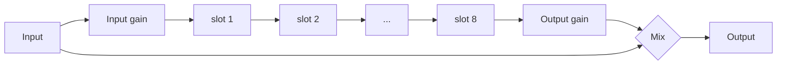

# EffectForce v0.1 design

The record of what v0.1 is and why, after the [probe](PROBE.md). Code follows it; where they
disagree, fix one of them.

- [What the probe decided](#what-the-probe-decided)
- [The rack](#the-rack)
- [Modules](#modules)
- [Modulation](#modulation)
- [Pages](#pages)
- [Presets](#presets)
- [Budget](#budget)
- [Code layout](#code-layout)
- [Tests](#tests)

---

## What the probe decided

| Probe finding | Design consequence |
|---|---|
| Insert effect works; tempo, beat position and play/stop arrive | Synced delay and LFOs lock to MPC's beat |
| `process` runs nonstop in real time, 128 frames, **in place** | Modules process in place; a module that needs its input after writing output keeps its own copy |
| Transport Stop: suspend + resume within ~100 ms; the slot's ON button: suspend, later resume, no `effSetBypass` | **Suspended for under 250 ms: keep every buffer** (tails survive Stop). **Longer: clear** (no stale echoes when a slot is switched back on) |
| `acceptIOChanges` no; latency only at creation | Every module zero-latency (no lookahead, no linear phase) |
| MPC polls names, categories and parameter texts hundreds of times a second | Getters read caches only; nothing in them allocates more than a short string |
| CPU of the probe 0.5% | The budget below is for the modules themselves |

## The rack



- **Eight modules, each exactly once:** Drive, Filter, EQ, Comp, Chorus, Phaser, Delay, Reverb.
  Each has its own parameters and page, so MPC's automation, Q-Links and saved projects always
  mean the same thing (generic slots would not). The default order is the one above.
- **Order:** eight hidden parameters `order_1..8` hold a permutation of the modules. The CHAIN
  page moves the selected module left or right (a swap). Saved by name (`order_3=Comp`); a state
  that isn't a permutation falls back to the default order.
- **On / off:** each module's own `*_on`. Switching fades over 10 ms; a module that is off is not
  processed at all (no CPU). A module switched on again starts from cleared state.
- **Reordering** dips the rack's output to silence over 3 ms, swaps, and fades back over 3 ms: no
  click, no doubled CPU.
- **Global:** Input and Output gain (-24..+24 dB), Mix (dry / wet of the whole chain; 100% for
  inserts, lower for parallel use).
- **Control rate:** 32-sample chunks. Per chunk: modulation, then each module's `set()` with its
  real parameter values, then `process()`. Modules smooth their own parameters across the chunk.

## Modules

Every module is a class in `dsp/` with the same shape:

```cpp
class Chorus {
public:
    struct Params { /* real values: Hz, seconds, dB, 0..1, option indices */ };
    Chorus();                                         // allocates (UI thread)
    void reset();                                     // clears all state; the next set() jumps to its targets
    void set(const Params& p, const Transport& t);    // once per chunk, before process()
    void process(float* L, float* R, int n);          // in place, 1 <= n <= kChunk
    int  tailSamples() const;                         // how long it rings after the input stops (0: none)
};
```

No allocation, locks or exceptions in `set` / `process`; finite output for any finite input and
any parameter values, including the extremes and abrupt changes; a NaN or infinity in the input
never gets into a feedback path. Each module's own Mix is a dry / wet blend inside it.

| Module | Parameters (key: range, default) | DSP |
|---|---|---|
| **Drive** | `drv_type` Soft · Tube · Hard · Fold · Sine · Crush; `drv_amt` 0..36 dB (12); `drv_tone` -1..1 tilt (0); `drv_bias` 0..1 (0); `drv_out` -24..12 dB (0); `drv_mix` (100%) | 2× oversampled (polyphase IIR halfband up and down, SubForce's design) around the shaper; bias before, DC blocker after; tilt EQ after; gain compensation so Drive mostly adds character, not level. Crush: bit depth and sample-rate reduction, not oversampled |
| **Filter** | `flt_type` LP 12 · LP 24 · HP 12 · HP 24 · BP · Notch; `flt_cut` 20..20k Hz log (1k); `flt_res` 0..1 (0.2); `flt_drive` 0..1 (0); `flt_spread` -1..1 octave L/R (0); `flt_mix` (100%) | Simper state-variable filter (TPT), coefficients interpolated across the chunk, soft saturation before it |
| **EQ** | `eq_lc` 20..1000 Hz (20 = off); `eq_lf` 30..500 Hz (100), `eq_lg` ±18 dB; `eq_mf` 100..10k (1k), `eq_mg` ±18 dB, `eq_mq` 0.3..8 (1); `eq_hf` 1k..16k (6k), `eq_hg` ±18 dB; `eq_hc` 1k..20k (20k = off) | Simper SVF shelves, bell, 12 dB/oct cuts; modulation-safe |
| **Comp** | `cmp_mode` Comp · OTT; Comp: `cmp_thr` -60..0 dB (-18), `cmp_ratio` 1..20 (4), `cmp_att` 0.1..100 ms (10), `cmp_rel` 10..2000 ms (150), `cmp_knee` 0..24 dB (6), `cmp_sc` sidechain low cut 20..500 Hz (20 = off), `cmp_makeup` -12..24 dB (0, both modes), `cmp_mix` (100%); OTT: `ott_depth` (60%), `ott_time` 0.1..10× (1), `ott_up` (100%), `ott_down` (100%), `ott_low` / `ott_mid` / `ott_high` ±12 dB | Comp: feed-forward, stereo-linked, soft knee, log-domain gain computer. OTT: 3 bands (Linkwitz-Riley 4th order at 88 Hz and 2.5 kHz, summing flat), each with downward and upward compression |
| **Chorus** | `chr_mode` Chorus · Ensemble · Dimension; `chr_rate` 0.03..10 Hz (0.5); `chr_depth` (50%); `chr_delay` 1..40 ms (12); `chr_lc` wet low cut 20..1000 Hz (120); `chr_width` (100%); `chr_mix` (50%) | Modulated delay lines with cubic interpolation: 2 voices per side (Chorus), 3 with a slow and a fast LFO (Ensemble), Juno-style antiphase pair (Dimension) |
| **Phaser** | `phs_mode` Phaser 4 · Phaser 8 · Phaser 12 · Flanger; `phs_sync` Free · Sync; `phs_rate` 0.01..20 Hz (0.3); `phs_div` 1/16..16 bars (1 bar); `phs_depth` (70%); `phs_center` 0..1 (0.5; 50 Hz..8 kHz for a phaser, 0.2..10 ms for the flanger); `phs_fb` -0.95..0.95 (0.5); `phs_stereo` 0..180° (90); `phs_mix` (50%) | First-order allpass cascade with feedback; the flanger a cubic-interpolated short delay with feedback. Synced: the LFO's phase follows MPC's beat |
| **Delay** | `dly_mode` Stereo · Ping-Pong · Mono; `dly_sync` Free · Sync (Sync); `dly_time` 1..2000 ms (375); `dly_div` 1/64..1 bar (1/8.); `dly_fb` 0..100% (40); `dly_spread` -50..50% R time (0); `dly_lc` 20..2000 Hz (100); `dly_hc` 500..20k Hz (8k); `dly_wow` (0); `dly_drive` (0); `dly_duck` (0); `dly_mix` (30%); `dly_glide` Tape · Fade | The probe's delay grown up: double-precision delay time that glides (Tape) or crossfades (Fade) to a new time, filters and a soft clipper in the feedback (100% feedback holds, never runs away), wow (slow + fast modulation of the time), ducking by the input's envelope |
| **Reverb** | `rev_mode` Room · Hall · Plate · Space; `rev_size` (50%); `rev_decay` 0.1..30 s (2.5); `rev_pre` 0..250 ms (20); `rev_damp` 1k..20k Hz (6k); `rev_lc` 20..1000 Hz (150); `rev_mod` (30%); `rev_width` (100%); `rev_freeze` Off · On; `rev_mix` (30%) | Predelay, input diffusion (allpasses), an 8-line feedback delay network (Hadamard mixing, per-line damping set from Decay and Damp, modulated lines), stereo taps. Freeze: lossless loop, input muted |

Every module also has `*_on` (Off / On). Sync divisions: delays `1/64 … 1 bar` (16 values),
LFOs `1/16 … 16 bars` (14 values), each with triplets and dotted values where they make sense.

## Modulation

- **Sources:** Macro 1-4 (knobs, 0..1), LFO 1 and 2 (-1..1), Envelope follower (0..1 from the
  input level).
- **LFO:** wave Sine · Triangle · Saw Up · Saw Down · Square · S&H · Smooth; Free (0.01..20 Hz)
  or Sync (1/16 … 16 bars, phase locked to MPC's beat while it plays); phase 0..360°.
- **Envelope follower:** attack 1..500 ms, release 10..3000 ms, gain 0..36 dB (sensitivity).
- **Matrix:** 8 slots of source, target, amount (-100..100%). A target is any of 48 continuous
  parameters (the levels, every module's main knobs, the LFO rates; a rate only while its LFO or
  phaser runs free). Modulation adds
  `amount × source` to the target's 0..1 value, clamped, so it follows the knob's own curve
  (log for frequencies, and so on). Computed per 32-sample chunk; modules smooth from there.

## Pages

Five groups (MPC's tab strip shows five without a pager), each page with its own Q-Link set:

| Group | Pages |
|---|---|
| CHAIN | **CHAIN**: the order as 8 tiles (lit = on, the selected one in brackets), MOVE ◀ / ▶, ON/OFF; Input, Output, Mix; Macros 1-4; the preset stepper. **PRESETS**: the browser (categories, presets, favorites, random, save, init) |
| TONE | **DRIVE+FILTER** (a card each), **EQ**, **COMP** (Comp and OTT cards) |
| MOTION | **CHORUS+PHASE** (a card each) |
| SPACE | **DELAY**, **REVERB** |
| MOD | **LFO+ENV** (LFO 1, LFO 2, envelope follower, macros), **MATRIX** (8 slots) |

## Presets

- Factory chain presets in `presets/Factory/NN_Category/NN_Name.efp`, embedded at build time and
  checked by `surface.py` like the synths'. Categories: Utility, Synth, Pads, Bass, Drums, Lo-Fi,
  Space, Creative. `Init`: everything off, unity.
- **Level-matched:** each preset is rendered over reference material at -18 LUFS (Synth and Pads:
  chords; Bass: a bass line; Drums: drums; the rest: all of it, `tools/loudness.h`) and its Output set
  so it comes out as loud as it went in (`make preset-levels`), within ±9 dB: a band-pass preset stays
  a little quieter rather than far too loud on material inside its band.
- User presets: `User NNN.efp` in the plugin folder's Presets (no text entry on the device).

## Budget

p99 ≤ 15% of a 2902 µs block with **every module on** (the worst case a preset can reach).
Targets on the Force (Cortex-A17), measured with `make bench-device`:

| Module | Target |
|---|---|
| Reverb | ≤ 4% |
| Drive (2× oversampled) | ≤ 1.5% |
| Comp in OTT mode | ≤ 2% |
| Chorus, Phaser, Delay, Filter, EQ, Comp | ≤ 0.8% each |

## Code layout

| Path | Contents |
|---|---|
| `dsp/common.h` | Rate, chunk size, `Transport`, sync divisions, smoothing, fast math |
| `dsp/simd.h`, `dsp/halfband.h` | SubForce's four-float vectors and halfband (plus the interpolator) |
| `dsp/drive.*`, `filter.*`, `eq.*`, `comp.*`, `chorus.*`, `phaser.*`, `delay.*`, `reverb.*` | The modules |
| `dsp/mod.h` | LFOs, envelope follower, matrix sources |
| `dsp/rack.*` | Order, fades, levels, modulation, the chunk loop |
| `plugin/` | SubForce's surface (Force input handling, browser, presets, state), the effect glue from the probe, the CHAIN page's actions |
| `surface/surface.py` | Parameters, pages (PolyForce's layout machinery and checks), factory presets |

## Tests

Per module (`test/<module>_test.cpp`): responses against theory (filter and EQ magnitudes,
compressor static curve, delay timing, reverb decay time), stability at the parameter extremes and
under abrupt changes, NaN input, in-place processing, block sizes 1..32, reset. For the rack and
plugin: all-off is bit-exact pass-through, order changes and on/off switching without clicks,
modulation, state round trip, every factory preset plays finite and level-matched, the Force's
input behaviour (taps, steppers, tiles), the suspend rule.
